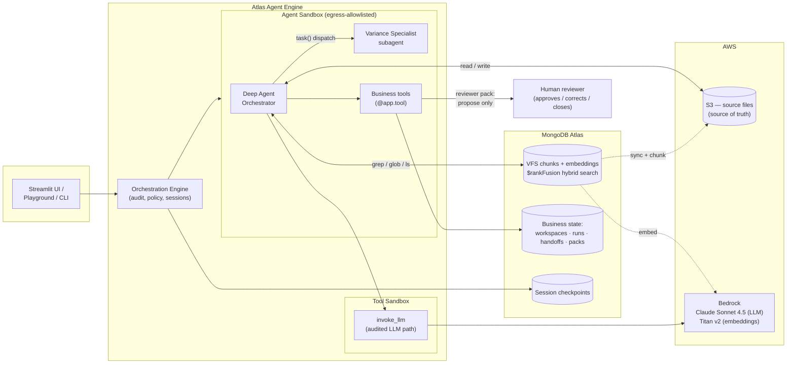

# Long-Running AI Agents on Atlas Agent Engine — BFSI Accrual Variance Review

A durable, evidence-driven agent workflow for month-end accrual variance
review.

- **Atlas Agent Engine** runs the agent (`accrual-variance-review/agent.yaml`
  → `src.demo_agent.main:app`; two-level layout with `project-config.yaml`
  at the repo root for the memory service;
  DeepAgents orchestrator + variance-analysis subagent via `task()` dispatch;
  durable sessions via the platform MongoDB checkpointer). Know more about MongoDB Atlas Agent Engine - https://www.mongodb.com/products/platform/atlas-agent-engine
- **LangChain Deep Agents VFS** (`langchain-mongodb-deepagents-vfs`) is the
  workspace backend: `grep`/`glob`/`ls` run as Atlas `$rankFusion` hybrid
  search; `read`/`write` hit S3, the source of truth for files. Know more about this package - https://github.com/langchain-ai/langchain-mongodb/tree/main/libs/langchain-mongodb-deepagents-vfs
- **AWS S3** retains raw source files; **MongoDB Atlas** stores searchable
  chunks/embeddings (VFS-owned) and business state (workspaces, runs,
  handoffs, reviewer packs — ours).
- **LLM:** AWS Bedrock (Claude Sonnet 4.5 via the Converse API, cross-region
  inference profile `us.anthropic.claude-sonnet-4-5-20250929-v1:0`) — the same
  boto3 credential chain as the embeddings; no third-party LLM API key.
  Fallback providers: `LLM_PROVIDER=anthropic|openai` + `LLM_API_KEY`.
- **Embeddings:** the VFS package default — AWS Bedrock
  `amazon.titan-embed-text-v2:0` @ 1024 dims via the boto3 credential chain.
- **Human-in-the-loop:** the agent gathers evidence and proposes; it never
  approves, posts, or closes. No such tool exists.
- **Memory:** cross-session recall via the platform memory service
  (`features.memory: true`; project config in `project-config.yaml`) —
  episodic (past reviews), semantic (durable facts via `remember_fact`),
  taxonomic (domain glossary). Memory informs; it never authorizes.

A clean checkout plus credentials generates the complete S3 dataset — no
manually prepared source artifacts are required.

## Architecture



## Quick start

```bash
make install                           # uv sync (SDK + deepagents + VFS backend)
cp .env.example .env                   # fill in MONGODB_URI, S3_BUCKET, AWS creds

make test                              # offline unit tests (no Atlas/S3/Bedrock)
make seed                              # generate -> upload/verify S3 -> register
                                       # -> VFS backend sync -> validate
make validate                          # re-check workspace + retrieval targets
make diagnose                          # platform/Atlas/collections/S3/seed/search
make ui                                # Streamlit UI (needs AGENT_ENGINE_URL)
make smoke                             # CLI smoke against the running agent
make reset                             # delete ONLY the solution's namespace

# platform lifecycle (agentengine CLI — download page, then `agentengine auth login`)
agentengine init                       # register workspace (.agentengine/state.json)
make atlas-setup                       # service account -> cluster + MONGODB_URI secret
agentengine secret set LLM_API_KEY
make validate-agent                    # agentengine agent validate --strict
make dev                               # agentengine dev up (local stack, hot reload)
make deploy-auto                       # build + deploy in one step
                                       # (or: make deploy = build && deploy)
```

**Reset boundary:** `reset` deletes only business docs whose `workspace_id`
matches the seeded workspace, VFS chunks whose `source_path` is under the
configured `S3_PREFIX`, and S3 objects under that prefix. Nothing else is
touched.

## Walkthrough

1. Workspace tab: artifacts, statuses, open evidence gap.
2. Agent tab: "Review the open accrual variance." The orchestrator greps
   `CON-7781` (exact) and "support for the June cloud-services accrual
   variance" (semantic) via the VFS backend's `$rankFusion` hybrid search,
   persists evidence references and run state to Atlas.
3. The missing `invoice_support_2026-06.pdf` is surfaced as an evidence gap —
   never as an invented conclusion.
4. "New session (simulate break)" → "Resume session": platform checkpointing
   (`features.durable_workflow`) plus our durable run record restore the
   workflow without the conversation transcript.
5. Handoff tab: the durable specialist handoff record, findings, evidence,
   unresolved questions.
6. Reviewer pack tab: evidence table, gaps, assumptions, and the HUMAN
   DECISION REQUIRED banner. There is no approve/post/close button.

CLI equivalent: `make smoke`. Presenter prompt runbook:
`docs/presenter_runbook.md`.

## Seeded scenario (all synthetic)

`accrual_review_demo_2026_06` · entity `demo_finance_india` · vendor
`VEN-2048` (Asterion Cloud Services India Pvt Ltd) · contract `CON-7781` ·
cost center `CC-410` · booked INR 1,240,000 vs expected INR 1,275,000 →
variance INR 35,000 · approval `pending_human_review` · missing artifact
`invoice_support_2026-06.pdf`. Values are cross-consistent across all seven
artifacts and validated on seed.

## Configuration

See `.env.example`. Deployed credentials come from platform secrets
(`agentengine secret set`) — never from committed files. The
`deterministic` embedding provider and `S3_BACKEND=local` exist only for
offline tests.

## Backup / failure recovery

| Failure | Backup path |
| --- | --- |
| Agent Engine unavailable | `agentengine dev up` locally against the same Atlas + S3 (labeled local fallback) |
| Search not ready | Re-run `make seed` (backend sync is idempotent via ETags); check `make diagnose` output |
| Bedrock throttled/unavailable | LLM: switch to `LLM_PROVIDER=openai` + `LLM_API_KEY` (and uncomment the `api.openai.com` egress line if deployed). Embeddings: backend falls back to full-text-only grep; narrate as such |
| Model latency high | The narrative continues from durable state + reviewer pack |
| UI fails | `make smoke` prints the full flow incl. the reviewer pack |
| No external services at all | `make test` exercises generation, hashing, consistency, reset isolation, tools, and the reviewer pack offline |

## Tests

`make test` covers artifact-generation determinism, S3 hash-verification
failure, variance cross-consistency, reseed idempotency, reset isolation
(business docs + VFS chunks + S3), all nine business tools via a fake App
(including the no-approval-tool invariant), and reviewer-pack sections,
evidence references, gap labeling, and the human boundary. Platform
integration tests (`tests/test_platform_integration.py`) run only when
`AGENT_ENGINE_URL` is set.
