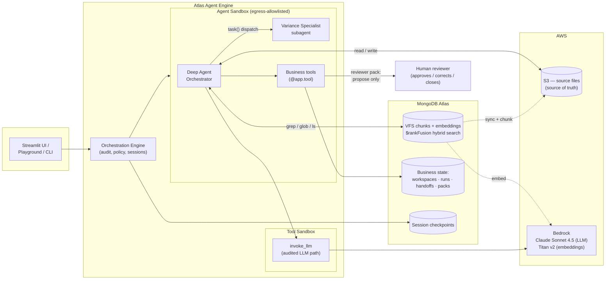

# Slide content — accrual variance review demo

## Slide 1 — The Use Case

**Title:** Month-End Accrual Variance Review — an Agent That Investigates, a Human That Decides

**The problem**
- Accruals are month-end *estimates* of expenses incurred but not yet invoiced — booked under time pressure, a classic source of close-process errors
- When booked ≠ expected, someone must dig through contracts, rate schedules, ERP extracts, and invoices to explain the difference — tedious, error-prone detective work, repeated every month
- In BFSI, an unexplained variance is an audit finding — so the investigation must be **evidenced** and the disposition must be **human**

**The demo scenario** (all synthetic)
- Vendor Asterion Cloud Services, contract CON-7781, contracted at **INR 12,75,000/month**
- June accrual booked at **INR 12,40,000** → **INR 35,000 short**; May was clean — so it's new
- The June invoice support file was never uploaded → **evidence gap**

**What the agent does**
1. Opens a durable run record — work survives session breaks
2. Searches the evidence corpus with Atlas **hybrid search** (`$rankFusion`: full-text + vector), every claim cited `file:line`
3. Detects missing evidence and reports it as an open question — **never invents it**
4. Hands quantification to a specialist subagent via a durable handoff
5. Produces a reviewer pack — findings, evidence table, gaps, recommended next step

**The trust boundary:** there is no approve / post / close tool. The agent proposes; the human disposes. *Structural, not a prompt instruction.*

**One-liner:** *Long-running, evidence-driven investigation over a document corpus — the machine gathers and proposes, the human decides.*

---

## Slide 2 — Architecture

**Title:** Deep Agents + Atlas Agent Engine + S3/Atlas Workspace

**Talking points**
- **VFS as the agent's filesystem:** the Deep Agents VFS backend makes S3 + Atlas look like a filesystem to the agent — `grep` is Atlas hybrid search, `read` streams from S3
- **Two kinds of state, both durable:** platform checkpointer restores *sessions*; our own collections preserve *business outcomes* — resume works even without the chat transcript
- **Sandboxed by default:** the agent can only reach S3, Bedrock, and the embedding CDN — everything else is denied at the network layer
- **Audited path:** every LLM and tool call routes through the Orchestration Engine — logged, policy-enforced, replayable
- **LLM is swappable config:** Bedrock by default; a corporate API gateway (`LLM_BASE_URL`) or Anthropic/OpenAI direct are one-line switches
- **The human is a system boundary,** not a step the agent can skip

**Alt note for the diagram:** if presenting the deployed topology, the same boxes apply — the "Atlas Agent Engine" subgraph runs as Orchestration Engine + Agent/Tool Sandboxes on the platform instead of local containers.
